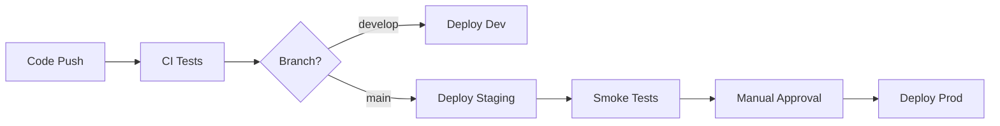

# CI/CD Guide

## Overview

The MMORPG Template uses GitHub Actions for continuous integration and deployment. The pipeline automatically builds, tests, and validates both the Go backend and Unreal Engine plugin.

## Workflows

### 1. Main CI/CD (`main.yml`)
- **Trigger**: Push/PR to main/develop branches
- **Purpose**: Orchestrates all other workflows
- **Features**:
  - Change detection
  - Quality gates
  - Integration tests
  - PR preview deployments

### 2. Go Backend (`go-backend.yml`)
- **Trigger**: Changes to `mmorpg-backend/`
- **Jobs**:
  - Lint: golangci-lint checks
  - Test: Unit tests with coverage
  - Build: Compile all services
  - Docker: Build container images

### 3. Unreal Plugin (`unreal-plugin.yml`)
- **Trigger**: Changes to `UnrealEngine/`
- **Jobs**:
  - Validate: Plugin structure check
  - Code Analysis: C++ formatting and quality
  - Build: Windows plugin build
  - Documentation: Doxygen generation

### 4. Protocol Buffers (`protobuf.yml`)
- **Trigger**: Changes to proto files
- **Jobs**:
  - Validate: Syntax and style checks
  - Generate: Go and C++ code generation
  - Documentation: Proto documentation

## Local Development

### Pre-commit Hooks
```bash
# Install pre-commit
pip install pre-commit

# Install hooks
pre-commit install

# Run manually
pre-commit run --all-files
```

### Running CI Locally
```bash
# Install act (GitHub Actions locally)
# Windows
choco install act

# macOS
brew install act

# Linux
curl https://raw.githubusercontent.com/nektos/act/master/install.sh | sudo bash

# Run workflows
act -W .github/workflows/go-backend.yml
act -W .github/workflows/unreal-plugin.yml
```

## Branch Protection

Recommended settings for `main` branch:
- Require pull request reviews (2 approvals)
- Dismiss stale PR approvals
- Require status checks:
  - `quality-gate`
  - `test-integration`
  - `lint`
  - `test`
- Require branches to be up to date
- Include administrators

## Secrets Management

Required GitHub secrets:
```yaml
# Docker Registry
DOCKER_REGISTRY_URL
DOCKER_REGISTRY_USERNAME
DOCKER_REGISTRY_PASSWORD

# Cloud Provider (for deployments)
AWS_ACCESS_KEY_ID
AWS_SECRET_ACCESS_KEY
GCP_SERVICE_ACCOUNT_KEY

# Monitoring
DATADOG_API_KEY
SENTRY_DSN

# Code Quality
SONARCLOUD_TOKEN
CODECOV_TOKEN
```

## Quality Gates

### Code Coverage
- Backend: Minimum 80% coverage
- New code: Minimum 90% coverage
- Critical paths: 100% coverage required

### Linting Rules
- Go: golangci-lint with strict config
- C++: clang-format with Unreal style
- Proto: buf lint with DEFAULT rules

### Security Scanning
- Dependency scanning via Dependabot
- Secret scanning enabled
- SAST scanning for vulnerabilities

## Deployment Pipeline

### Environments
1. **Development**: Auto-deploy from `develop`
2. **Staging**: Auto-deploy from `main`
3. **Production**: Manual approval required

### Deployment Process


## Monitoring

### Build Status
- Dashboard: `https://github.com/[org]/[repo]/actions`
- Slack notifications: #mmorpg-ci channel
- Email alerts for failures

### Metrics
- Build time trends
- Test execution time
- Failure rate tracking
- Coverage trends

## Troubleshooting

### Common Issues

#### 1. Proto Generation Fails
```bash
# Regenerate locally
cd mmorpg-backend
make proto
git add -A
git commit -m "fix: regenerate proto files"
```

#### 2. Go Module Issues
```bash
# Update dependencies
cd mmorpg-backend
go mod tidy
go mod vendor
```

#### 3. UE Build Fails
- Check UE version compatibility
- Verify plugin dependencies
- Clean and rebuild locally

### Debug Mode
```yaml
# Add to workflow for debugging
- name: Debug
  run: |
    echo "Event: ${{ github.event_name }}"
    echo "Ref: ${{ github.ref }}"
    echo "SHA: ${{ github.sha }}"
    env | sort
```

## Best Practices

1. **Commit Messages**: Use conventional commits
   ```
   feat(auth): add JWT refresh endpoint
   fix(game): resolve memory leak in world manager
   docs(api): update REST API documentation
   ```

2. **PR Process**:
   - Create feature branch from `develop`
   - Write descriptive PR description
   - Link related issues
   - Add appropriate labels

3. **Testing**:
   - Write tests for new features
   - Run tests locally before push
   - Fix failing tests immediately

4. **Performance**:
   - Use workflow caching
   - Parallelize independent jobs
   - Optimize Docker layers

## Resources

- [GitHub Actions Documentation](https://docs.github.com/en/actions)
- [Conventional Commits](https://www.conventionalcommits.org/)
- [golangci-lint](https://golangci-lint.run/)
- [buf](https://buf.build/)