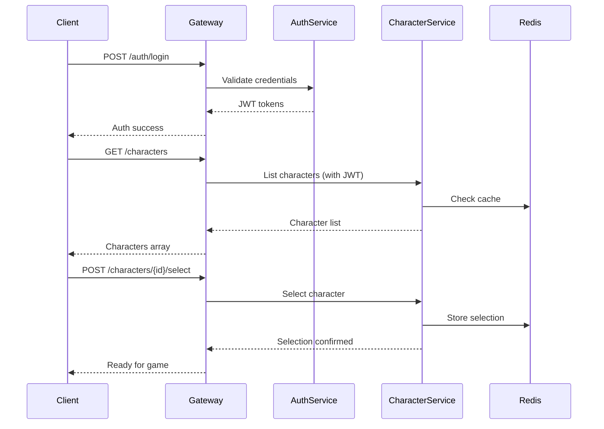

# 🔗 Phase 1.5: Character System - Integration Guide

## Overview

This guide details how Phase 1.5 (Character System) integrates with existing Phase 1 (Authentication) and prepares for Phase 2 (Real-time Networking). It provides concrete implementation patterns, migration strategies, and integration points.

---

## Integration with Phase 1 (Authentication)

### Authentication Flow Enhancement

The character system extends the authentication flow to include character selection:



### JWT Token Enhancement

Extend JWT claims to include selected character:

```go
// Extended JWT claims
type GameClaims struct {
    jwt.StandardClaims
    UserID      uuid.UUID  `json:"user_id"`
    Username    string     `json:"username"`
    Roles       []string   `json:"roles"`
    CharacterID *uuid.UUID `json:"character_id,omitempty"`
    CharacterName string   `json:"character_name,omitempty"`
}

// Token refresh with character
func (s *AuthService) RefreshTokenWithCharacter(ctx context.Context, 
    refreshToken string, characterID uuid.UUID) (*TokenPair, error) {
    
    // Validate refresh token
    claims, err := s.validateRefreshToken(refreshToken)
    if err != nil {
        return nil, err
    }
    
    // Verify character ownership
    character, err := s.characterService.GetCharacter(ctx, characterID)
    if err != nil || character.UserID != claims.UserID {
        return nil, ErrUnauthorized
    }
    
    // Generate new tokens with character info
    return s.generateTokenPair(claims.UserID, &characterID, character.Name)
}
```

### Session Storage Update

Extend session data to include character information:

```go
// Enhanced session structure
type GameSession struct {
    SessionID    string    `json:"session_id"`
    UserID       uuid.UUID `json:"user_id"`
    CharacterID  uuid.UUID `json:"character_id"`
    CharacterName string   `json:"character_name"`
    IPAddress    string    `json:"ip_address"`
    UserAgent    string    `json:"user_agent"`
    CreatedAt    time.Time `json:"created_at"`
    UpdatedAt    time.Time `json:"updated_at"`
    ExpiresAt    time.Time `json:"expires_at"`
}

// Redis key patterns
const (
    SessionKey = "session:%s"              // session:session_id
    UserSessionsKey = "user:sessions:%s"   // user:sessions:user_id
    CharacterSessionKey = "character:session:%s" // character:session:character_id
)
```

### Database Schema Integration

Update the users table to track character-related information:

```sql
-- Add character tracking to users table
ALTER TABLE users 
ADD COLUMN selected_character_id UUID REFERENCES characters(id),
ADD COLUMN last_character_switch TIMESTAMP WITH TIME ZONE,
ADD COLUMN total_characters_created INTEGER DEFAULT 0;

-- Add index for quick lookups
CREATE INDEX idx_users_selected_character ON users(selected_character_id);

-- Update character count trigger
CREATE OR REPLACE FUNCTION update_user_character_count()
RETURNS TRIGGER AS $$
BEGIN
    IF TG_OP = 'INSERT' THEN
        UPDATE users 
        SET character_count = character_count + 1,
            total_characters_created = total_characters_created + 1
        WHERE id = NEW.user_id;
    ELSIF TG_OP = 'DELETE' THEN
        UPDATE users 
        SET character_count = character_count - 1
        WHERE id = OLD.user_id;
    END IF;
    RETURN NULL;
END;
$$ LANGUAGE plpgsql;

CREATE TRIGGER update_character_count
AFTER INSERT OR DELETE ON characters
FOR EACH ROW EXECUTE FUNCTION update_user_character_count();
```

---

## Frontend Integration Patterns

### Auth Widget Enhancement

Modify the existing auth widget to include character selection:

```cpp
// UMMORPGAuthWidget.h - Enhanced
UCLASS(Abstract)
class MMORPGUI_API UMMORPGAuthWidget : public UUserWidget
{
    GENERATED_BODY()

public:
    // Existing methods...
    
    // New character methods
    UFUNCTION(BlueprintCallable, Category = "MMORPG|Auth")
    void ShowCharacterSelectionView();
    
    UFUNCTION(BlueprintCallable, Category = "MMORPG|Auth")
    void ShowCharacterCreationView();

protected:
    // Additional widgets
    UPROPERTY(meta = (BindWidget))
    class UMMORPGCharacterSelectionWidget* CharacterSelectionWidget;
    
    UPROPERTY(meta = (BindWidget))
    class UMMORPGCharacterCreationWidget* CharacterCreationWidget;
    
    // Enhanced events
    UFUNCTION(BlueprintImplementableEvent, Category = "MMORPG|Auth")
    void OnCharacterSelected(const FCharacterInfo& Character);
    
private:
    UFUNCTION()
    void HandleAuthenticationComplete();
    
    UFUNCTION()
    void HandleCharacterSelectionComplete(const FString& CharacterID);
};
```

### Game Mode Transition

Update the auth game mode to handle character selection:

```cpp
// AMMORPGAuthGameMode.cpp
void AMMORPGAuthGameMode::OnCharacterSelected(const FCharacterInfo& Character)
{
    // Store selected character
    if (UMMORPGCharacterSubsystem* CharSubsystem = GetGameInstance()->
        GetSubsystem<UMMORPGCharacterSubsystem>())
    {
        CharSubsystem->SetSelectedCharacter(Character);
    }
    
    // Transition to main game
    UGameplayStatics::OpenLevel(this, TEXT("MainGameMap"), true, 
        FString::Printf(TEXT("?CharacterID=%s"), *Character.CharacterID));
}

// AMMORPGMainGameMode.cpp
void AMMORPGMainGameMode::InitGame(const FString& MapName, 
    const FString& Options, FString& ErrorMessage)
{
    Super::InitGame(MapName, Options, ErrorMessage);
    
    // Extract character ID from options
    FString CharacterID = UGameplayStatics::ParseOption(Options, TEXT("CharacterID"));
    
    if (CharacterID.IsEmpty())
    {
        ErrorMessage = TEXT("No character selected");
        return;
    }
    
    // Prepare for character spawn
    PendingCharacterID = CharacterID;
}
```

### Subsystem Coordination

Ensure auth and character subsystems work together:

```cpp
// Character subsystem initialization
void UMMORPGCharacterSubsystem::Initialize(FSubsystemCollectionBase& Collection)
{
    Super::Initialize(Collection);
    
    // Get auth subsystem
    AuthSubsystem = Collection.InitializeDependency<UMMORPGAuthSubsystem>();
    
    // Subscribe to auth events
    if (AuthSubsystem)
    {
        AuthSubsystem->OnLoginResponse.AddDynamic(this, 
            &UMMORPGCharacterSubsystem::HandleLoginSuccess);
        AuthSubsystem->OnLogoutComplete.AddDynamic(this, 
            &UMMORPGCharacterSubsystem::HandleLogout);
    }
}

void UMMORPGCharacterSubsystem::HandleLoginSuccess(const FAuthResponse& Response)
{
    if (Response.bSuccess)
    {
        // Automatically fetch character list after login
        GetCharacterList();
    }
}

void UMMORPGCharacterSubsystem::HandleLogout()
{
    // Clear cached character data
    CachedCharacters.Empty();
    SelectedCharacter = FCharacterInfo();
}
```

---

## Preparation for Phase 2 (Networking)

### WebSocket Authentication Enhancement

Prepare WebSocket connection to include character data:

```go
// WebSocket upgrade with character
func (h *WebSocketHandler) Upgrade(w http.ResponseWriter, r *http.Request) {
    // Extract JWT from query or header
    token := r.URL.Query().Get("token")
    if token == "" {
        token = r.Header.Get("Authorization")
    }
    
    // Validate token and extract claims
    claims, err := h.authService.ValidateToken(token)
    if err != nil {
        http.Error(w, "Unauthorized", http.StatusUnauthorized)
        return
    }
    
    // Verify character selection
    if claims.CharacterID == nil {
        http.Error(w, "No character selected", http.StatusBadRequest)
        return
    }
    
    // Create player session
    session := &PlayerSession{
        UserID:      claims.UserID,
        CharacterID: *claims.CharacterID,
        CharacterName: claims.CharacterName,
        Connection:  nil, // Will be set after upgrade
    }
    
    // Upgrade to WebSocket
    conn, err := h.upgrader.Upgrade(w, r, nil)
    if err != nil {
        return
    }
    
    session.Connection = conn
    h.sessionManager.AddSession(session)
    
    // Send initial character state
    h.sendInitialState(session)
}
```

### Character State for Networking

Define character state structure for real-time sync:

```go
// Character network state
type CharacterNetworkState struct {
    CharacterID   uuid.UUID     `json:"character_id"`
    Name          string        `json:"name"`
    Position      WorldPosition `json:"position"`
    Health        int           `json:"health"`
    Mana          int           `json:"mana"`
    Level         int           `json:"level"`
    Zone          string        `json:"zone"`
    LastUpdate    time.Time     `json:"last_update"`
    MovementSpeed float32       `json:"movement_speed"`
    ActionState   string        `json:"action_state"`
}

// Prepare for Phase 2 message types
type GameMessage struct {
    Type      string          `json:"type"`
    Timestamp time.Time       `json:"timestamp"`
    Data      json.RawMessage `json:"data"`
}

// Character-specific messages
const (
    MsgCharacterSpawn    = "character.spawn"
    MsgCharacterMove     = "character.move"
    MsgCharacterAction   = "character.action"
    MsgCharacterDespawn  = "character.despawn"
    MsgCharacterUpdate   = "character.update"
)
```

### Pre-load Character Data for Fast Spawn

Cache character data for quick world entry:

```go
// Character pre-loading service
type CharacterPreloadService struct {
    cache         cache.Cache
    characterRepo repository.CharacterRepository
}

func (s *CharacterPreloadService) PreloadCharacter(ctx context.Context, 
    characterID uuid.UUID) error {
    
    // Load full character data
    character, err := s.characterRepo.GetByID(ctx, characterID)
    if err != nil {
        return err
    }
    
    // Load related data in parallel
    g, ctx := errgroup.WithContext(ctx)
    
    var appearance *CharacterAppearance
    var stats *CharacterStats
    var position *WorldPosition
    
    g.Go(func() error {
        appearance, err = s.characterRepo.GetAppearance(ctx, characterID)
        return err
    })
    
    g.Go(func() error {
        stats, err = s.characterRepo.GetStats(ctx, characterID)
        return err
    })
    
    g.Go(func() error {
        position, err = s.characterRepo.GetPosition(ctx, characterID)
        return err
    })
    
    if err := g.Wait(); err != nil {
        return err
    }
    
    // Cache assembled data
    preloadData := &CharacterPreloadData{
        Character:  character,
        Appearance: appearance,
        Stats:      stats,
        Position:   position,
        CachedAt:   time.Now(),
    }
    
    key := fmt.Sprintf("character:preload:%s", characterID)
    return s.cache.Set(ctx, key, preloadData, 5*time.Minute)
}
```

---

## Migration Strategy

### Phase 1 to Phase 1.5 Migration

1. **Database Migration**:
```bash
# Run character table migrations
migrate -path migrations -database postgres://... up

# Verify migration
psql -c "SELECT * FROM schema_migrations"
```

2. **Backend Deployment**:
```yaml
# docker-compose.yml update
services:
  character-service:
    build: ./cmd/character
    environment:
      - DB_CONNECTION_STRING=...
      - REDIS_URL=...
      - AUTH_SERVICE_URL=http://auth-service:8080
    ports:
      - "8082:8082"
    depends_on:
      - postgres
      - redis
      - auth-service
```

3. **Frontend Update Process**:
```cpp
// Version check in game instance
void UMMORPGGameInstance::Init()
{
    Super::Init();
    
    // Check for character system support
    CheckServerCapabilities();
}

void UMMORPGGameInstance::CheckServerCapabilities()
{
    // Request server features
    HttpClient->Get("/api/v1/features", [this](const FHttpResponse& Response)
    {
        if (Response.Features.Contains("character_system_v1"))
        {
            bCharacterSystemEnabled = true;
            // Enable character UI
        }
        else
        {
            // Fall back to direct game entry
            bCharacterSystemEnabled = false;
        }
    });
}
```

### Backward Compatibility

Support players during transition:

```go
// Gateway routing with fallback
func (g *Gateway) routeRequest(w http.ResponseWriter, r *http.Request) {
    // Check if character system is required
    if strings.HasPrefix(r.URL.Path, "/api/v1/game/") {
        // Verify character selection
        claims := r.Context().Value("claims").(*GameClaims)
        
        if claims.CharacterID == nil && g.config.RequireCharacter {
            // Redirect to character selection
            http.Error(w, "Character selection required", http.StatusPreconditionRequired)
            w.Header().Set("X-Character-Selection-URL", "/api/v1/characters")
            return
        }
    }
    
    // Continue with normal routing
    g.proxy.ServeHTTP(w, r)
}
```

---

## Testing Integration

### Integration Test Suite

```go
// Character system integration tests
func TestCharacterAuthIntegration(t *testing.T) {
    // Setup
    authService := setupAuthService(t)
    charService := setupCharacterService(t)
    
    // Test flow
    t.Run("CompleteAuthToGameFlow", func(t *testing.T) {
        // 1. Register user
        user, err := authService.Register(ctx, RegisterRequest{
            Email:    "test@example.com",
            Username: "testuser",
            Password: "password123",
        })
        require.NoError(t, err)
        
        // 2. Login
        tokens, err := authService.Login(ctx, LoginRequest{
            Email:    "test@example.com",
            Password: "password123",
        })
        require.NoError(t, err)
        
        // 3. Create character
        character, err := charService.CreateCharacter(ctx, user.ID, 
            CreateCharacterRequest{
                Name:  "TestHero",
                Class: CharacterClassWarrior,
                Race:  CharacterRaceHuman,
            })
        require.NoError(t, err)
        
        // 4. Select character
        selected, err := charService.SelectCharacter(ctx, user.ID, character.ID)
        require.NoError(t, err)
        require.True(t, selected.IsSelected)
        
        // 5. Verify enhanced token
        newTokens, err := authService.RefreshTokenWithCharacter(ctx, 
            tokens.RefreshToken, character.ID)
        require.NoError(t, err)
        
        claims, err := authService.ValidateToken(newTokens.AccessToken)
        require.NoError(t, err)
        require.Equal(t, character.ID, *claims.CharacterID)
    })
}
```

### Load Testing Character Operations

```go
// Vegeta load test script
func TestCharacterLoadScenario(t *testing.T) {
    // Character creation load test
    rate := vegeta.Rate{Freq: 100, Per: time.Second}
    duration := 30 * time.Second
    
    targeter := vegeta.NewStaticTargeter(vegeta.Target{
        Method: "POST",
        URL:    "http://localhost:8090/api/v1/characters",
        Body:   []byte(`{"name":"LoadTest{{.WorkerID}}","class":1,"race":1}`),
        Header: http.Header{
            "Authorization": []string{"Bearer " + testToken},
            "Content-Type":  []string{"application/json"},
        },
    })
    
    attacker := vegeta.NewAttacker()
    
    var metrics vegeta.Metrics
    for res := range attacker.Attack(targeter, rate, duration, "Character Creation") {
        metrics.Add(res)
    }
    metrics.Close()
    
    // Assert performance targets
    require.Less(t, metrics.Latencies.P95, 1*time.Second)
    require.Greater(t, metrics.Success, 0.99) // 99% success rate
}
```

---

## Monitoring and Observability

### Character System Metrics

```go
// Prometheus metrics
var (
    charactersCreated = promauto.NewCounterVec(
        prometheus.CounterOpts{
            Name: "mmorpg_characters_created_total",
            Help: "Total number of characters created",
        },
        []string{"class", "race"},
    )
    
    characterSelections = promauto.NewCounter(
        prometheus.CounterOpts{
            Name: "mmorpg_character_selections_total",
            Help: "Total number of character selections",
        },
    )
    
    characterCacheHits = promauto.NewCounter(
        prometheus.CounterOpts{
            Name: "mmorpg_character_cache_hits_total",
            Help: "Total number of character cache hits",
        },
    )
)
```

### Grafana Dashboard Queries

```sql
-- Characters created per hour by class
SELECT 
    date_trunc('hour', created_at) as hour,
    class,
    COUNT(*) as characters_created
FROM characters
WHERE created_at > NOW() - INTERVAL '24 hours'
GROUP BY hour, class
ORDER BY hour DESC;

-- Character selection patterns
SELECT 
    c.name,
    c.class,
    c.level,
    COUNT(DISTINCT session_id) as selection_count,
    MAX(last_played_at) as last_played
FROM characters c
JOIN character_sessions cs ON c.id = cs.character_id
WHERE cs.created_at > NOW() - INTERVAL '7 days'
GROUP BY c.id, c.name, c.class, c.level
ORDER BY selection_count DESC
LIMIT 20;
```

---

## Common Integration Issues and Solutions

### Issue 1: Character Not Found After Login
```go
// Solution: Implement retry with cache invalidation
func (s *CharacterService) GetUserCharactersWithRetry(ctx context.Context, 
    userID uuid.UUID) ([]*Character, error) {
    
    // Try cache first
    characters, err := s.cache.GetUserCharacters(ctx, userID)
    if err == nil && len(characters) > 0 {
        return characters, nil
    }
    
    // Cache miss or empty, load from DB
    characters, err = s.repo.GetByUserID(ctx, userID)
    if err != nil {
        return nil, err
    }
    
    // Update cache
    s.cache.SetUserCharacters(ctx, userID, characters)
    
    return characters, nil
}
```

### Issue 2: JWT Token Size with Character Data
```go
// Solution: Store minimal data in JWT, fetch details from cache
type MinimalGameClaims struct {
    jwt.StandardClaims
    UserID      uuid.UUID  `json:"uid"`
    CharacterID *uuid.UUID `json:"cid,omitempty"`
}

// Fetch full data when needed
func (s *AuthService) GetFullSessionData(ctx context.Context, 
    claims *MinimalGameClaims) (*FullSessionData, error) {
    
    // Parallel fetch
    g, ctx := errgroup.WithContext(ctx)
    
    var user *User
    var character *Character
    
    g.Go(func() error {
        user, err = s.userRepo.GetByID(ctx, claims.UserID)
        return err
    })
    
    if claims.CharacterID != nil {
        g.Go(func() error {
            character, err = s.charRepo.GetByID(ctx, *claims.CharacterID)
            return err
        })
    }
    
    if err := g.Wait(); err != nil {
        return nil, err
    }
    
    return &FullSessionData{User: user, Character: character}, nil
}
```

---

## Conclusion

Phase 1.5 successfully bridges the authentication system (Phase 1) and the upcoming real-time networking (Phase 2) by providing:

1. **Seamless Auth Integration**: Character selection naturally extends the login flow
2. **Network Preparation**: Character data structures ready for real-time sync
3. **Performance Optimization**: Caching and pre-loading for fast game entry
4. **Backward Compatibility**: Graceful degradation for transition period
5. **Monitoring**: Comprehensive metrics for system health

The character system provides the essential identity layer that transforms authenticated users into game-ready players, setting the stage for the networked gameplay features in Phase 2.