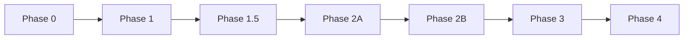

# 📊 MMORPG Game Template - Comprehensive Project Management Plan

## Executive Summary

This document serves as the master project management plan for the MMORPG Game Template development. It defines the project structure, management methodology, success metrics, resource allocation, and governance framework for delivering a production-ready MMORPG template over the next 7-9 months.

**Project Vision**: Create a professional, scalable MMORPG template that serves as a foundation for commercial game development, featuring modern architecture, comprehensive documentation, and production-ready tools.

**Strategic Goals**:
1. Deliver a complete, working MMORPG template
2. Provide comprehensive documentation for developers
3. Ensure production-ready quality and performance
4. Create sustainable development practices
5. Enable easy customization and extension

---

## Project Structure

### Phase Hierarchy

```
MMORPG Game Template Project
├── Phase 0: Foundation Layer [COMPLETE]
├── Phase 1: Authentication System [COMPLETE]
├── Phase 1.5: Character System Foundation [NEW]
├── Phase 2A: Core Real-time Infrastructure [REVISED]
├── Phase 2B: Advanced Networking Features [REVISED]
├── Phase 3: Core Gameplay Systems
└── Phase 4: Production Tools & Polish
```

### Phase Dependencies



---

## Management Methodology

### Development Approach

**Hybrid Agile-Waterfall Model**
- **Waterfall**: High-level phase planning and dependencies
- **Agile**: Within-phase development using 1-week sprints
- **Kanban**: Task tracking and work-in-progress limits

### Sprint Structure (Weekly)

**Monday**: Sprint planning and goal setting
**Tuesday-Thursday**: Development work
**Friday**: Testing, documentation, and review
**End of Sprint**: Demo and retrospective

### Communication Cadence

1. **Daily Standups** (15 min)
   - What was completed yesterday
   - What will be worked on today
   - Any blockers or concerns

2. **Weekly Reviews** (1 hour)
   - Sprint demo
   - Progress against phase goals
   - Risk review
   - Next sprint planning

3. **Phase Reviews** (2 hours)
   - Comprehensive phase retrospective
   - Deliverable verification
   - Stakeholder sign-off
   - Next phase kick-off

---

## Resource Management

### Team Structure

#### Core Development Team
```
Project Manager (25%)
├── Technical Lead (100%)
│   ├── Backend Developer (100%)
│   ├── Frontend Developer (100%)
│   └── DevOps Engineer (75%)
├── QA Lead (50%)
│   └── QA Engineer (25-100% variable)
└── Documentation Lead (25%)
    └── Technical Writer (25-50% variable)
```

#### Extended Team (As Needed)
- UI/UX Designer (50% during UI phases)
- Security Engineer (Phase 4)
- Performance Engineer (Phases 2B, 3)
- Database Administrator (Phase 1.5, 3)

### Resource Allocation by Phase

| Phase | Backend Dev | Frontend Dev | DevOps | QA | UI/UX | Other |
|-------|------------|--------------|--------|-----|-------|--------|
| 1.5   | 100%       | 100%         | 25%    | 25% | 50%   | DBA: 25% |
| 2A    | 100%       | 100%         | 50%    | 25% | 25%   | - |
| 2B    | 75%        | 100%         | 75%    | 50% | -     | Perf: 50% |
| 3     | 100%       | 100%         | 50%    | 50% | 50%   | - |
| 4     | 50%        | 75%          | 100%   | 75% | 25%   | Sec: 50% |

### Budget Allocation

**Development Costs** (70%)
- Salaries and contractor fees
- Development tools and licenses
- Training and certification

**Infrastructure Costs** (20%)
- Cloud services (AWS/GCP)
- Development/staging environments
- Monitoring and security tools
- CI/CD infrastructure

**Operational Costs** (10%)
- Documentation tools
- Project management software
- Communication platforms
- Contingency reserve

---

## Risk Management Framework

### Risk Assessment Matrix

| Risk Category | Probability | Impact | Mitigation Strategy |
|--------------|------------|---------|-------------------|
| Technical Debt | High | Medium | Regular refactoring sprints |
| Scope Creep | Medium | High | Strict change control process |
| Key Person Dependency | Medium | High | Cross-training and documentation |
| Technology Changes | Low | High | Architecture abstraction layers |
| Performance Issues | Medium | Medium | Continuous performance testing |
| Security Vulnerabilities | Low | Critical | Security reviews each phase |

### Risk Response Plans

#### High Priority Risks

1. **Network Architecture Scalability**
   - **Response**: Prototype early in Phase 2A
   - **Trigger**: Load test shows < 100 concurrent users
   - **Action**: Architecture review and redesign

2. **Database Performance**
   - **Response**: Performance testing in Phase 1.5
   - **Trigger**: Query time > 100ms for common operations
   - **Action**: Query optimization or schema redesign

3. **Integration Complexity**
   - **Response**: Integration tests from Phase 2A
   - **Trigger**: Integration test failure rate > 20%
   - **Action**: Simplify interfaces or add abstraction layer

### Contingency Planning

**Schedule Contingencies**
- 10% buffer built into each phase
- Optional features identified for scope reduction
- Parallel work streams where possible

**Resource Contingencies**
- Approved contractor list for surge capacity
- Cross-training plan for all critical roles
- Documentation standards to enable handoffs

---

## Quality Assurance Strategy

### Quality Gates by Phase

#### Phase 1.5 Quality Gates
- [ ] Character CRUD operations functional
- [ ] 90% code coverage on backend
- [ ] UI responsive on all target resolutions
- [ ] Performance: < 1s character creation
- [ ] Security: No SQL injection vulnerabilities

#### Phase 2A Quality Gates
- [ ] WebSocket connections stable for 1+ hours
- [ ] Message delivery < 100ms latency
- [ ] 95% successful auto-reconnection rate
- [ ] Support 100+ concurrent connections
- [ ] Zero memory leaks in 24-hour test

#### Phase 2B Quality Gates
- [ ] State synchronization at 60 FPS
- [ ] < 50ms latency for critical updates
- [ ] 80% bandwidth reduction achieved
- [ ] Support 1000+ concurrent connections
- [ ] Client prediction accuracy > 95%

#### Phase 3 Quality Gates
- [ ] All gameplay systems integrated
- [ ] < 16ms frame time with all systems
- [ ] Combat feels responsive at 100ms latency
- [ ] Zero item duplication bugs
- [ ] 95% test automation coverage

#### Phase 4 Quality Gates
- [ ] 99.9% admin tool availability
- [ ] < 10 minute deployment time
- [ ] All runbooks documented
- [ ] Security audit passed
- [ ] Team training completed

### Testing Strategy

**Unit Testing**
- Minimum 80% code coverage
- Automated with every commit
- Backend and frontend coverage

**Integration Testing**
- API contract testing
- Service interaction testing
- Database integration verification

**System Testing**
- End-to-end user scenarios
- Performance benchmarking
- Security vulnerability scanning

**User Acceptance Testing**
- Developer experience validation
- Documentation completeness
- API usability testing

---

## Deliverable Management

### Deliverable Categories

1. **Code Deliverables**
   - Source code with comments
   - Unit and integration tests
   - Build and deployment scripts
   - Configuration templates

2. **Documentation Deliverables**
   - API documentation
   - Architecture diagrams
   - Setup guides
   - Troubleshooting guides
   - Video tutorials

3. **Infrastructure Deliverables**
   - Docker configurations
   - Kubernetes manifests
   - CI/CD pipelines
   - Monitoring dashboards

4. **Tool Deliverables**
   - Admin dashboard
   - Content management system
   - Developer utilities
   - Debugging tools

### Acceptance Criteria Framework

Each deliverable must meet:
1. **Functional Requirements**: Does what it's supposed to do
2. **Performance Requirements**: Meets defined metrics
3. **Quality Requirements**: Passes all quality gates
4. **Documentation Requirements**: Fully documented
5. **Operational Requirements**: Can be deployed and maintained

---

## Change Management Process

### Change Request Workflow

```
1. Change Request Submitted
   ↓
2. Impact Analysis (Technical Lead)
   ↓
3. Schedule/Budget Impact (PM)
   ↓
4. Approval Decision
   ├─ Approved → 5. Implementation Planning
   └─ Rejected → Archive
```

### Change Categories

**Minor Changes** (< 8 hours)
- Approved by Technical Lead
- Implemented in current sprint
- No formal documentation required

**Medium Changes** (8-40 hours)
- Requires PM approval
- Scheduled for next sprint
- Update phase documentation

**Major Changes** (> 40 hours)
- Requires stakeholder approval
- May impact phase timeline
- Full impact analysis required

---

## Communication Plan

### Stakeholder Matrix

| Stakeholder | Interest | Influence | Communication Frequency |
|------------|----------|-----------|----------------------|
| Development Team | High | High | Daily |
| Project Sponsor | Medium | High | Weekly |
| Future Users | High | Low | Phase Completion |
| Operations Team | Medium | Medium | Bi-weekly |

### Communication Channels

1. **Project Dashboard** (Real-time)
   - Current sprint progress
   - Burn-down charts
   - Risk indicators
   - Quality metrics

2. **Status Reports** (Weekly)
   - Accomplishments
   - Upcoming work
   - Risks and issues
   - Budget status

3. **Phase Reports** (Phase completion)
   - Deliverable summary
   - Lessons learned
   - Quality metrics
   - Next phase preview

---

## Success Metrics

### Project-Level KPIs

1. **Schedule Performance**
   - Target: 90% of milestones met on time
   - Measurement: Milestone completion dates

2. **Quality Performance**
   - Target: < 5 critical bugs in production
   - Measurement: Bug tracking system

3. **Budget Performance**
   - Target: Within 10% of allocated budget
   - Measurement: Financial tracking

4. **Team Performance**
   - Target: < 10% unplanned turnover
   - Measurement: Team retention rate

### Phase-Level Metrics

| Phase | Primary Metric | Target | Secondary Metrics |
|-------|---------------|---------|-------------------|
| 1.5 | Character creation time | < 1s | API response time, UI responsiveness |
| 2A | Connection stability | 99% uptime | Message latency, reconnection success |
| 2B | State sync performance | 60 FPS | Bandwidth usage, prediction accuracy |
| 3 | Feature completeness | 100% | Bug density, test coverage |
| 4 | Tool availability | 99.9% | Deployment time, documentation score |

---

## Governance Structure

### Decision Making

**Technical Decisions**
- Owner: Technical Lead
- Consultation: Development Team
- Approval: Documented in ADRs

**Schedule Decisions**
- Owner: Project Manager
- Consultation: Technical Lead
- Approval: Stakeholder for major changes

**Budget Decisions**
- Owner: Project Sponsor
- Consultation: Project Manager
- Approval: Required for > 10% variance

### Review Boards

**Architecture Review Board** (Monthly)
- Reviews technical decisions
- Ensures architectural consistency
- Approves major technical changes

**Quality Review Board** (Phase completion)
- Validates quality gates
- Reviews test results
- Approves phase completion

---

## Training and Knowledge Transfer

### Documentation Standards

1. **Code Documentation**
   - Inline comments for complex logic
   - Function/method documentation
   - README files for each module

2. **Architecture Documentation**
   - C4 diagrams for system architecture
   - Sequence diagrams for workflows
   - Decision records (ADRs)

3. **Operational Documentation**
   - Runbooks for common tasks
   - Troubleshooting guides
   - Performance tuning guides

### Training Plan

**Phase-End Training** (Each phase)
- Technical deep-dive sessions
- Hands-on workshops
- Q&A sessions
- Recorded for future reference

**Final Training** (Phase 4)
- Complete system walkthrough
- Operations training
- Support handoff
- Certification program

---

## Project Closure

### Closure Activities

1. **Final Deliverable Review**
   - All code repositories tagged
   - Documentation complete
   - Tools deployed and tested

2. **Knowledge Transfer**
   - Training sessions completed
   - Support documentation handed off
   - Team Q&A sessions held

3. **Lessons Learned**
   - Project retrospective
   - Best practices documented
   - Improvement recommendations

4. **Administrative Closure**
   - Contracts closed
   - Resources released
   - Final reports submitted

### Success Celebration

- Team recognition event
- Project showcase presentation
- Success metrics publication
- Future roadmap discussion

---

## Appendices

### A. Template Documents
- Change Request Form
- Risk Register Template
- Status Report Template
- Phase Completion Checklist

### B. Tool Configurations
- JIRA project setup
- Git repository structure
- CI/CD pipeline templates
- Monitoring dashboard configs

### C. Contact Information
- Team roster with roles
- Escalation contacts
- Vendor contacts
- Support channels

---

**Document Version**: 1.0
**Effective Date**: July 29, 2025
**Review Cycle**: Monthly
**Owner**: Project Manager

*This project management plan is a living document and will be updated as the project progresses and new information becomes available.*